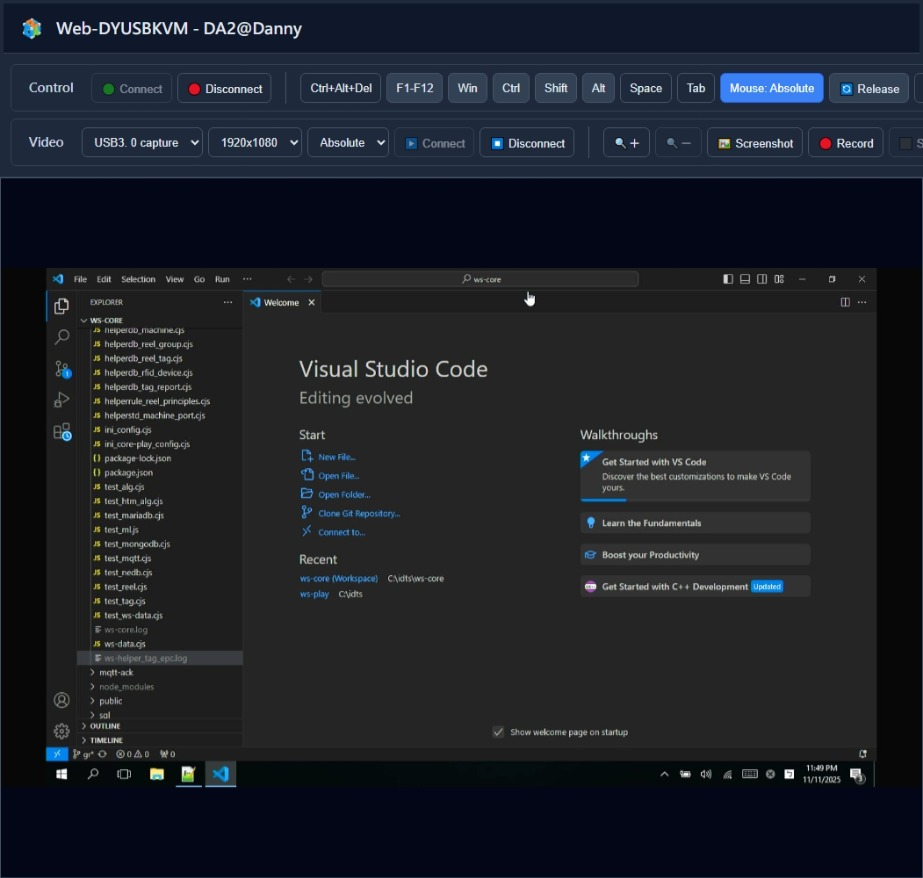

# Web-DYUSBKVM

> 基於 CH9329 模組的 Web USBKVM 系統

-----

## 專案概述

Web-DYUSBKVM 是一個基於 CH9329 模組的 Web USBKVM 系統，使用純前端技術實現 HDMI 擷取器畫面顯示與鍵盤滑鼠控制功能。本專案參考了 [JTUSBKVM](https://github.com/jasoncheng7115/JTUSBKVM) 的設計，但改用 CH9329 模組直接進行 Serial to HID 轉換，簡化了硬體架構。



-----

## 主要特色

### 硬體架構
- **CH9329 模組**：直接將串口指令轉換為 HID 鍵盤滑鼠訊號
- **HDMI 擷取器**：用於顯示被控制端畫面（硬體解析度固定為 1920x1080）
- **簡化設計**：相較於 JTUSBKVM 的雙 Arduino 架構，僅需一個 CH9329 模組

### 軟體功能

#### 視訊顯示功能
- **視訊串流**：顯示被控端畫面，支援 USB HDMI Capture 裝置
- **模擬解析度設定**：可選擇多種模擬解析度（1024x600、1280x720、1280x800、1366x768、1440x900、1600x900、1920x1080、1920x1200、2560x1440、2560x1600、2880x1800、3200x1800、3840x2160）
- **自動比例調整**：視訊顯示會根據選擇的模擬解析度自動調整顯示比例，保持正確的畫面比例
- **座標映射**：使用模擬解析度進行滑鼠座標映射計算，確保座標精確對應
- **視訊縮放**：支援 100% 至 300% 的畫面縮放功能
- **擷圖功能**：可擷取當前視訊畫面並下載為圖片
- **錄影功能**：可錄製視訊畫面並下載為影片檔（支援 MP4/WebM 格式）
- **除錯資訊顯示**：即時顯示瀏覽器座標、模擬解析度座標、CH9329 座標等除錯資訊

#### 鍵盤控制功能
- **完整鍵盤支援**：支援所有標準鍵盤按鍵輸入
- **功能鍵**：支援 F1-F12 功能鍵
- **修飾鍵**：支援 Win、Ctrl、Shift、Alt 修飾鍵的切換操作
- **特殊按鍵**：提供 Space、Tab 專用按鈕
- **組合鍵**：支援 Ctrl+Alt+Del 組合鍵
- **文字輸入工具**：支援批量文字輸入功能，可逐字模擬鍵盤輸入（僅支援英文、數字、符號）

#### 滑鼠控制功能
- **雙模式支援**：
  - **相對位置模式**：流暢的滑鼠移動（適合一般操作）
  - **絕對位置模式**：精確的座標定位（適合需要精確點擊的場景）
- **按鍵支援**：支援滑鼠左鍵、右鍵、中鍵
- **滾輪支援**：支援滑鼠滾輪上下捲動
- **座標映射**：自動將螢幕座標映射到 CH9329 的 0-4096 座標範圍
- **即時座標顯示**：除錯模式下可即時查看座標轉換資訊

#### 其他功能
- **跨平台支援**：支援 Windows、Linux、macOS，搭配 Chrome、Chromium 或 Edge 瀏覽器
- **純前端實現**：無需後端伺服器（本地執行時僅需 HTTP 伺服器提供靜態檔案）
- **設定持久化**：自動儲存視訊來源、模擬解析度、滑鼠移動模式等設定
- **視覺化介面**：視訊顯示區域具有白色邊框，便於識別顯示範圍

-----

## 硬體需求

### 必要硬體
- **CH9329 模組** x 1
  - 建議設定波特率為 115200（預設為 9600，需使用廠商工具配置）
  - 串口包間隔：1ms
- **HDMI 擷取器** x 1
  - 支援 USB 視訊輸入的 HDMI 擷取器
  - 硬體解析度固定為 1920x1080
- **USB 線材**
  - CH9329 模組連接至控制端電腦的 USB 線
  - HDMI 擷取器連接至控制端電腦的 USB 線

### 連接方式
1. **CH9329 模組**：
   - USB 連接埠 → 控制端電腦（透過 USB 線）
   - 模組會自動被識別為 HID 鍵盤滑鼠設備

2. **HDMI 擷取器**：
   - HDMI 輸入 → 被控制端電腦的 HDMI 輸出
   - USB 輸出 → 控制端電腦的 USB 連接埠

3. **被控制端電腦**：
   - 將 CH9329 模組的 USB 輸出（HID 模式）連接到被控制端電腦
   - 注意：CH9329 模組需要配置為 HID 模式，而非串口模式

-----

## 系統需求

### 控制端電腦
- **作業系統**：Windows 10/11、macOS 或 Linux
- **瀏覽器**：Chrome 89+、Chromium 89+ 或 Edge 89+（需支援 Web Serial API 和 MediaStream API）
- **Python**：3.6+（僅用於本地執行時啟動 HTTP 伺服器）
- **OpenSSL**：用於生成 SSL 憑證（僅用於本地執行）

### 被控制端電腦
- 任何支援 USB HID 鍵盤滑鼠的作業系統
- 無需安裝任何軟體

-----

## 安裝與使用

### 方式一：本地執行（推薦）

#### Windows
1. 下載專案檔案至本地目錄（例如 `C:\Web-DYUSBKVM`）
2. 確保已安裝 Python 3.6+ 和 OpenSSL
3. 進入 `local_run` 目錄
4. 以**系統管理員身份**執行 `start_kvm.bat`
5. 瀏覽器會自動開啟 Web-DYUSBKVM 介面

#### Linux/macOS
1. 下載專案檔案至本地目錄（例如 `/opt/web-dyusbkvm`）
2. 確保已安裝 Python 3.6+ 和 OpenSSL
3. 進入 `local_run` 目錄
4. 執行 `chmod +x start_kvm.sh` 賦予執行權限
5. 執行 `./start_kvm.sh`
6. 瀏覽器會自動開啟 Web-DYUSBKVM 介面

### 方式二：線上執行（需部署）

將 `web` 目錄下的檔案部署到支援 HTTPS 的 Web 伺服器上，即可透過瀏覽器直接訪問。

-----

## 使用說明

### 連接步驟

1. **連接視訊擷取器**
   - 點擊「Video」區域的「▶️ Connect」按鈕
   - 選擇您的 HDMI 擷取器裝置
   - 視訊畫面應該會顯示在頁面上（硬體解析度為 1920x1080）

2. **設定模擬解析度**
   - 在「Video」區域選擇「模擬解析度」下拉選單
   - 選擇符合被控制端螢幕的解析度（預設為 1920x1080）
   - 視訊顯示會自動根據模擬解析度調整比例
   - 此設定用於正確計算滑鼠座標映射

3. **連接 CH9329 模組**
   - 點擊「Control」區域的「🟢 Connect」按鈕
   - 在瀏覽器彈出的裝置選擇視窗中，選擇您的 CH9329 模組
   - 連接成功後，控制按鈕會變為可用狀態

4. **選擇滑鼠移動模式**
   - 在「Video」區域選擇「滑鼠移動模式」下拉選單
   - **Relative（相對位置）**：流暢的滑鼠移動（適合一般操作）
   - **Absolute（絕對位置）**：精確的座標定位（適合需要精確點擊的場景）

5. **開始控制**
   - 在視訊畫面上移動滑鼠，滑鼠指標會同步移動到被控制端
   - 點擊滑鼠按鍵可控制被控制端
   - 使用鍵盤輸入文字
   - 使用滾輪可捲動頁面

### 功能說明

#### 控制功能
- **🟢 Connect / 🔴 Disconnect**：連接/中斷 CH9329 模組
- **Ctrl+Alt+Del**：發送 Ctrl+Alt+Delete 組合鍵
- **F1-F12**：點擊按鈕開啟功能鍵選單，選擇要發送的功能鍵
- **Win / Ctrl / Shift / Alt**：切換修飾鍵狀態（按鈕會顯示 active 狀態）
- **Space / Tab**：發送 Space 或 Tab 按鍵
- **🔄 Release**：釋放所有按下的修飾鍵
- **📋 Paste**：開啟文字傳送工具，可批量輸入文字（僅支援英文、數字、符號）

#### 視訊功能
- **▶️ Connect / ⏹️ Disconnect**：連接/中斷視訊擷取器
- **模擬解析度**：選擇用於座標映射的模擬解析度（視訊顯示會自動調整比例）
- **滑鼠移動模式**：選擇相對位置或絕對位置模式
- **🔍＋ / 🔍－**：放大/縮小視訊畫面（100% 至 300%）
- **🖼️ Screenshot**：擷取當前畫面並下載為圖片
- **🔴 Record / ⬛ Stop**：錄製視訊畫面並下載為影片檔

#### 除錯功能
- **除錯資訊顯示**：在視訊畫面上顯示即時座標資訊
  - 瀏覽器座標：滑鼠在瀏覽器中的座標
  - 模擬解析度座標：映射到模擬解析度的座標
  - CH9329 座標：最終發送到 CH9329 的座標（0-4096 範圍）
  - 模擬解析度：當前選擇的模擬解析度

-----

## CH9329 模組配置

### 重要設定

在使用前，請確保 CH9329 模組已正確配置：

1. **波特率**：建議設定為 115200（預設為 9600）
2. **串口包間隔**：設定為 1ms
3. **工作模式**：設定為 HID 鍵盤滑鼠模式

### 配置方法

使用 CH9329 廠商提供的配置工具進行設定，或參考 CH9329 通訊協議文件透過串口發送配置指令。

-----

## 技術架構

### 前端技術
- **HTML + CSS + JavaScript**：純前端實現
- **Web Serial API**：與 CH9329 模組通訊
- **MediaStream API**：接收 HDMI 擷取器視訊

### 通訊協議
- **CH9329 二進制封包格式**：使用標準 CH9329 通訊協議
- **HID Key Code 映射**：將瀏覽器鍵盤事件轉換為 HID 鍵盤掃描碼
- **滑鼠座標映射**：
  - 硬體解析度：固定為 1920x1080
  - 模擬解析度：使用者選擇的解析度，用於座標計算
  - CH9329 座標：映射到 0-4096 範圍的絕對座標

### 座標映射機制

1. **硬體層級**：HDMI 擷取器固定輸出 1920x1080 解析度
2. **顯示層級**：根據選擇的模擬解析度自動計算顯示比例，保持正確的畫面比例
3. **座標計算**：
   - 滑鼠在瀏覽器中的座標 → 映射到模擬解析度座標
   - 模擬解析度座標 → 映射到 CH9329 的 0-4096 座標範圍
4. **自動調整**：視訊顯示大小會根據模擬解析度自動調整，確保座標映射準確

### 與 JTUSBKVM 的主要差異
1. **硬體架構**：使用 CH9329 模組替代兩個 Arduino
2. **通訊協議**：從文字指令改為 CH9329 二進制封包
3. **功能範圍**：移除終端機 Console 功能，專注於 HDMI 擷取 + 鍵盤滑鼠控制
4. **座標映射**：使用模擬解析度進行座標映射，支援多種解析度設定

-----

## 檔案結構

```
Web-DYUSBKVM/
├── web/
│   ├── index.html          # 主頁面（包含所有 UI 和邏輯）
│   ├── js/
│   │   └── ch9329.js       # CH9329 通訊模組（封包生成、HID 映射）
│   └── logo.png            # Logo 圖片
├── local_run/
│   ├── server.py           # HTTP 伺服器（簡化版，僅提供靜態檔案和 SSL）
│   ├── start_kvm.bat      # Windows 啟動腳本
│   └── start_kvm.sh       # Linux/macOS 啟動腳本
├── ch9329.md               # CH9329 協議文檔（完整參考資料）
├── LICENSE                 # 授權文件
└── README.md               # 本說明文件
```

-----

## 注意事項

1. **CH9329 配置**：
   - 首次使用前請確認 CH9329 模組已正確配置為 HID 模式
   - 建議設定波特率為 115200（預設為 9600）
   - 串口包間隔設定為 1ms

2. **瀏覽器權限**：首次連接時，瀏覽器會要求授予序列埠和視訊權限，請點擊「允許」

3. **SSL 憑證**：本地執行時會使用自簽憑證，瀏覽器會顯示安全警告，請點擊「進階」→「繼續前往」

4. **模擬解析度設定**：
   - **模擬解析度**：選擇符合被控制端螢幕的解析度，用於座標映射計算
   - **硬體解析度**：固定為 1920x1080（由 HDMI 擷取器決定）
   - **顯示比例**：系統會根據模擬解析度自動調整視訊顯示比例，保持正確的畫面比例
   - 選擇正確的模擬解析度可確保滑鼠座標精確對應

5. **滑鼠移動模式**：
   - **相對位置（Relative）**：適合一般操作，移動更流暢
   - **絕對位置（Absolute）**：適合需要精確點擊的場景，座標更精確
   - 切換模式時會自動重置追蹤位置，避免座標不一致

6. **按鍵釋放**：當瀏覽器失去焦點或切換分頁時，會自動釋放所有按下的按鍵

7. **座標映射**：
   - CH9329 內部使用 4096×4096 解析度
   - 系統會自動將模擬解析度座標映射到此範圍
   - 除錯模式下可即時查看座標轉換過程

8. **文字輸入限制**：
   - 文字傳送工具僅支援英文、數字、符號
   - 不支援中文、日文、韓文等非英文字元
   - 輸入非英文字元時會提示警告

9. **視訊顯示**：
   - 視訊顯示區域具有白色邊框，便於識別顯示範圍
   - 視訊會根據模擬解析度自動調整顯示大小，保持正確比例
   - 支援 100% 至 300% 的縮放功能

-----

## 授權

本專案基於 GNU Affero General Public License v3.0 授權。

本專案參考了 [JTUSBKVM](https://github.com/jasoncheng7115/JTUSBKVM) 的設計，感謝 Jason Cheng 的開源貢獻。

-----

## 免責聲明

本專案僅供學習、研究及個人使用，開發者不對本工具的功能完整性、穩定性或適用性提供任何明示或暗示的保證。使用者需自行承擔使用本工具的一切風險。

-----

## 相關資源

- [JTUSBKVM 原始專案](https://github.com/jasoncheng7115/JTUSBKVM)
- [CH9329 通訊協議文檔](ch9329.md)（本專案已整理完整協議文檔）
- [CH9329 官方文檔](https://www.wch.cn/downloads/CH9329DS_PDF.html)
- [Web Serial API 文檔](https://developer.mozilla.org/en-US/docs/Web/API/Web_Serial_API)
- [MediaStream API 文檔](https://developer.mozilla.org/en-US/docs/Web/API/MediaStream_API)

## 技術細節

### CH9329 協議實現

本專案完整實現了 CH9329 協議，包括：

- **鍵盤命令（CMD 0x02）**：支持 8+6 無衝突按鍵，完整的修飾鍵支持
- **絕對滑鼠命令（CMD 0x04）**：7 字節數據格式，座標映射到 0-4096 範圍
- **相對滑鼠命令（CMD 0x05）**：5 字節數據格式，支持有符號移動距離
- **HID 鍵碼映射**：完整的 HID Page 0x07 鍵碼表

詳細協議說明請參考 [ch9329.md](ch9329.md) 文檔。

### 座標映射詳細說明

1. **硬體層級**：
   - HDMI 擷取器固定輸出 1920×1080 解析度
   - 此為硬體層級的實際解析度

2. **模擬解析度**：
   - 使用者可選擇多種模擬解析度（1024×600 至 3840×2160）
   - 此解析度用於座標映射計算，不影響硬體輸出

3. **顯示層級**：
   - 系統根據模擬解析度計算顯示比例
   - 視訊顯示大小會自動調整，保持正確的畫面比例
   - 例如：選擇 1280×800 時，視訊會按比例縮小顯示

4. **座標轉換流程**：
   ```
   瀏覽器座標 → 模擬解析度座標 → CH9329 座標 (0-4096)
   ```
   - 滑鼠在瀏覽器中的位置 → 映射到模擬解析度座標 → 映射到 CH9329 內部座標

5. **除錯資訊**：
   - 除錯模式下可即時查看各層級的座標轉換
   - 有助於驗證座標映射是否正確

## Donate

[](https://www.paypal.me/dannytwdanny)